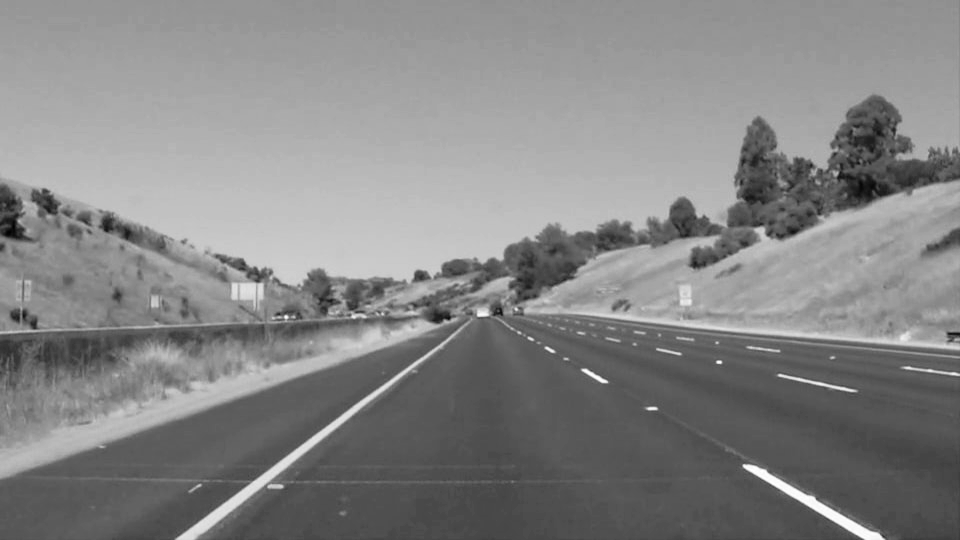
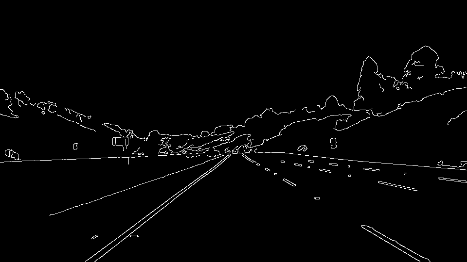
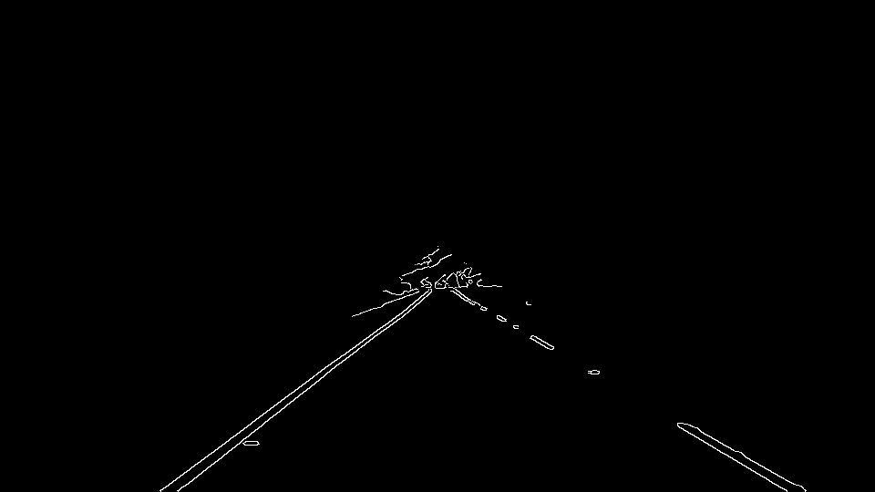
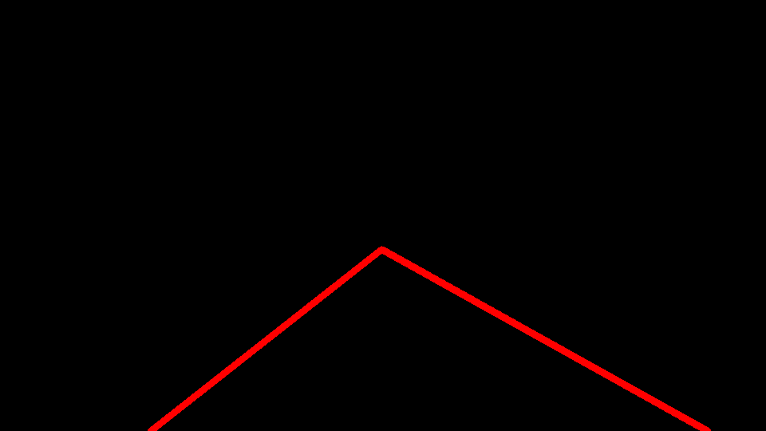
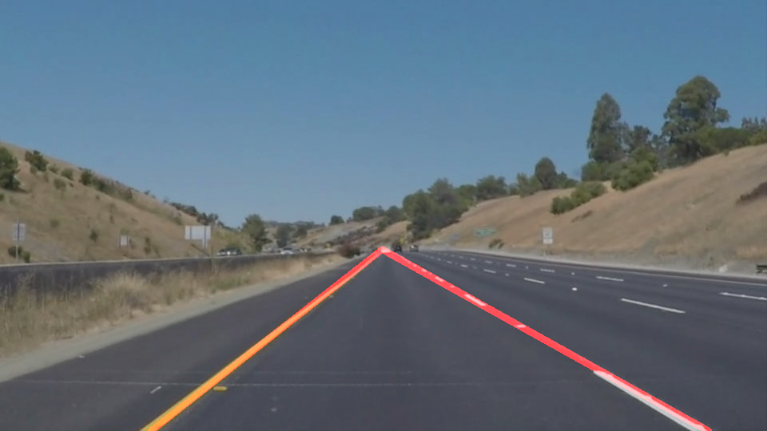

# **Finding Lane Lines on the Road** 

### Demo:
**Solid White Lanes**

 
  Click for full video.

**Solid Yellow Lanes**

 
  Click for full video.

### Overview

When we drive, we use our eyes to decide where to go.  The lines on the road that show us where the lanes are act as our constant reference for where to steer the vehicle.  Naturally, one of the first things we would like to do in developing a self-driving car is to automatically detect lane lines using an algorithm.

### Goal:

* Build a pipeline that finds lane lines on the road using Python and OpenCV

### Repo Structure: 
* [`P1.ipynb`]((https://github.com/iLitton/CarND-LaneLines-P1/blob/master/P1.ipynb)): walkthrough and solution
* [`P1_writeup.md`](https://github.com/iLitton/CarND-LaneLines-P1/blob/master/writeup/P1_writeup.md): project reflection

### Set Up Requirements

Choose one of the following options to set up:  

**Option 1:** Follow the instructions to install [CarND Term1 Starter Kit](https://github.com/udacity/CarND-Term1-Starter-Kit/blob/master/README.md)

**Option 2:** Download and install the following:

* Python 3
* `pip install opencv-python`
* `pip install matplotlib`

### To Run
To start Jupyter in your browser, use terminal to navigate to your project directory and then run the following command at the terminal prompt:

`jupyter notebook`

A browser window will appear showing the contents of the current directory.  Click on the file called `P1.ipynb`. 

---

## 1. Pipeline Description

My pipeline can be described by the following steps:  

1. Preprocess image   
    **1.1.** Tranform to grayscale  

	    

	**1.2.** Apply Gaussian smoothing to remove noise    
	
	    
	
    (Although it may not look like it, the image is slightly blurred! 😅)    
    
	**1.3.** Use Canny Edge Detection Algorithm    
	
	    
	
	**1.4.** Mask image to ignore pixels outside region of interest    
	
	    
	
	**1.5.** Apply Hough transformation to improve edge detection    
	
	 

**2.** Extrapolate Hough line segments to map out the full extent of the lanes  

**3.** Combine image overlayed with line segments with original image  

  
		
In order to draw a single line on the left and right lanes, I modified the draw_lines() function by the following steps:

**1.** Detect left and right lane based on the slope of the line segment  
**2.** Average the position of each Hough line to extrapolate the line segment to top and and bottom of the lane

## 2. Identify potential shortcomings and improvements to the current pipeline

Potential shortcomings are:  

**1.** Detecting turns and curves  

The current pipeline only accounts for straight roads. Fitting linear models to detect the lane markings will not be able to account for any curved roads. A possible fix to detect curved lanes would be to try fitting different models like quadratic. 

**2.** Lane changes
    
This pipeline assumes the car stays within the center of one lane and does not change lanes. It will not be able to detect a change of lanes and may not be able to efficiently detect lanes when the car veers within the lane. Adjusting the parameterization of x and y in Hough transformation to polar coordinates _r_ and _θ_ could help improve the algorithm to detect curves. [1](http://research.ijcaonline.org/volume122/number13/pxc3905011.pdf)

**3.** Night time & poor weather conditions
    
Some parameters for Canny Edge and Hough transformation may have to be adjusted to detect the lane segments at night or when it's rainy/snowy and even difficult to see the lanes with human eyes. A histogram equalizer or contrast limited adjusted histogram equalizer could be applied to improve the image contrast for these situations. [2](http://docs.opencv.org/3.1.0/d5/daf/tutorial_py_histogram_equalization.html)

### References
 [1] [Curved Lane Detection using Improved Hough
Transform and CLAHE in a Multi-Channel ROI](http://research.ijcaonline.org/volume122/number13/pxc3905011.pdf)
 
 [2] [Histogram Equalization](http://docs.opencv.org/3.1.0/d5/daf/tutorial_py_histogram_equalization.html)
 
 [3] [OpenCV documentation](http://docs.opencv.org/3.1.0/d2/d96/tutorial_py_table_of_contents_imgproc.html)