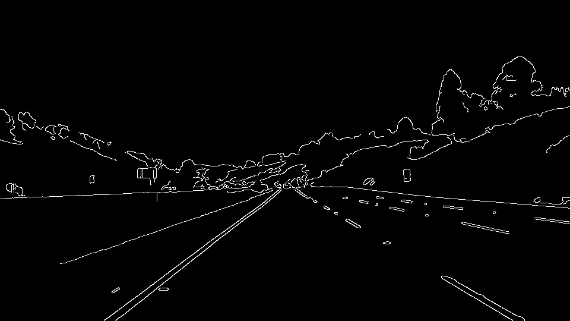
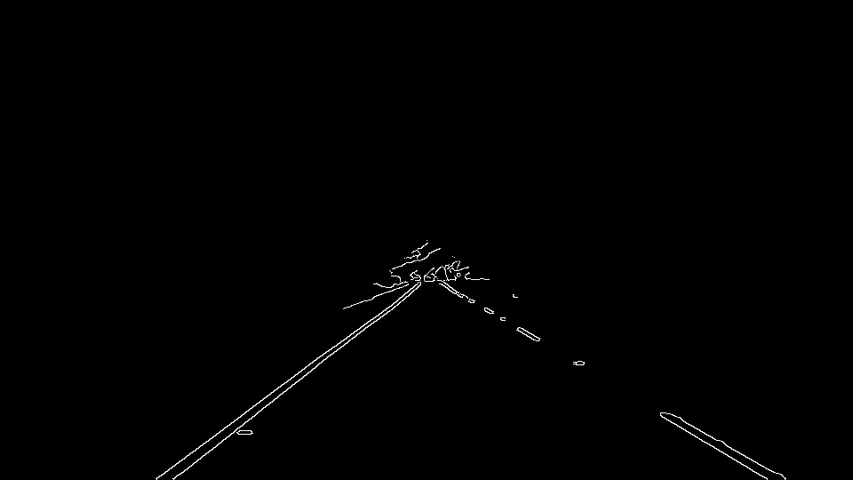
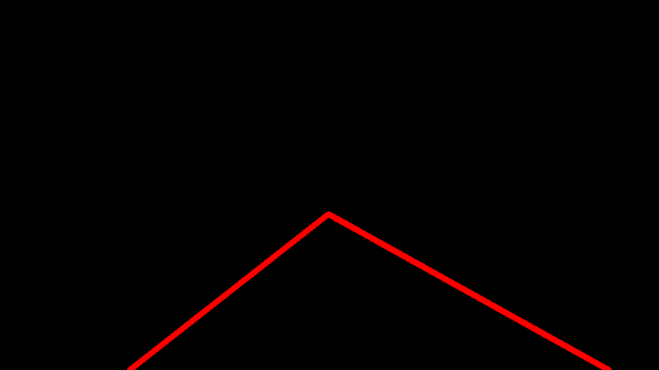
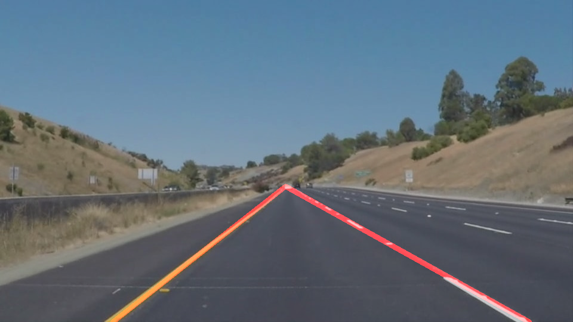

# Finding Lane Lines on the Road Reflection

The goals/steps of this project are the following:

* Make a pipeline that finds lane lines on the road

---

## 1. Pipeline Description

My pipeline can be described by the following steps:  

1. Preprocess image   
    **1.1.** Tranform to grayscale  

	    

	**1.2.** Apply Gaussian smoothing to remove noise    
	
	    
	
    (Although it may not look like it, the image is slightly blurred! 😅)    
    
	**1.3.** Use Canny Edge Detection Algorithm    
	
	    
	
	**1.4.** Mask image to ignore pixels outside region of interest    
	
	    
	
	**1.5.** Apply Hough transformation to improve edge detection    
	
	 

**2.** Extrapolate Hough line segments to map out the full extent of the lanes  

**3.** Combine image overlayed with line segments with original image  

  
		
In order to draw a single line on the left and right lanes, I modified the draw_lines() function by the following steps:

**1.** Detect left and right lane based on the slope of the line segment  
**2.** Average the position of each Hough line to extrapolate the line segment to top and and bottom of the lane

## 2. Identify potential shortcomings and improvements to the current pipeline

Potential shortcomings are:  

**1.** Detecting turns and curves  

The current pipeline only accounts for straight roads. Fitting linear models to detect the lane markings will not be able to account for any curved roads. A possible fix to detect curved lanes would be to try fitting different models like quadratic. 

**2.** Lane changes
    
This pipeline assumes the car stays within the center of one lane and does not change lanes. It will not be able to detect a change of lanes and may not be able to efficiently detect lanes when the car veers within the lane. Adjusting the parameterization of x and y in Hough transformation to polar coordinates _r_ and _θ_ could help improve the algorithm to detect curves. [1](http://research.ijcaonline.org/volume122/number13/pxc3905011.pdf)

**3.** Night time & poor weather conditions
    
Some parameters for Canny Edge and Hough transformation may have to be adjusted to detect the lane segments at night or when it's rainy/snowy and even difficult to see the lanes with human eyes. A histogram equalizer or contrast limited adjusted histogram equalizer could be applied to improve the image contrast for these situations. [2](http://docs.opencv.org/3.1.0/d5/daf/tutorial_py_histogram_equalization.html)

### References
 [1] http://research.ijcaonline.org/volume122/number13/pxc3905011.pdf  
 
 [2] http://docs.opencv.org/3.1.0/d5/daf/tutorial_py_histogram_equalization.html  
 
 [3] OpenCV documentation [http://docs.opencv.org/3.1.0/d2/d96/tutorial_py_table_of_contents_imgproc.html]