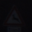
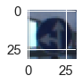
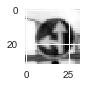
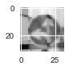
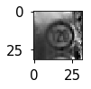

## Project: Build a Traffic Sign Recognition Program

### Goals/Steps:

* Explore, summarize and visualize the [German Traffic Sign Dataset](http://benchmark.ini.rub.de/?section=gtsrb&subsection=dataset)
* Design, train and test a convolutional neural network model
* Use the model to make predictions on new traffic sign images 
* Analyze the softmax probabilities of the new images

### Repo Structure: 
* [`Traffic_Sign_Classifier.ipynb`](Traffic_Sign_Classifier.ipynb): walkthrough and solution
* [`signnames.csv`](signnames.csv): mapping table of labels to sign names
* [`./writeup/`](./writeup/): directory with images included in the writeup below

### Dependencies
This lab requires:

* [CarND Term1 Starter Kit](https://github.com/udacity/CarND-Term1-Starter-Kit)

The lab environment can be created with CarND Term1 Starter Kit. Click [here](https://github.com/udacity/CarND-Term1-Starter-Kit/blob/master/README.md) for the details.

[//]: # (Image References)

[image1]: ./writeup/Data_Dist.png "Label Distribution"
[image2]: ./writeup/Data_Dist_Train_Test.png "Train vs Test"
[image3]: ./writeup/Original.png "Original Image"
[image4]: ./writeup/Adaptive_Hist.png "Adaptive Histogram"
[image5]: ./writeup/CLAHE.png "CLAHE"
[image6]: ./writeup/Normalization.png "Normalization"
[image7]: ./writeup/LeCun.jpeg "LeCun Model"
[image8]: ./writeup/Test_Images.png "New Image Examples"
[image9]: ./writeup/Predictions.png "Predictions on New Images"
[image10]: ./writeup/Misclassified_Example.png "Misclassified Speed Limit"
[image11]: ./writeup/Softmax_Probs.png "Softmax Probabilities"

---

### Data Set Summary & Exploration

**1. Basic summary of the data set**

* The size of training set is 34799
* The size of the validation set is 4410
* The size of test set is 12630
* The shape of a traffic sign image is (32, 32, 3)
* The number of unique classes/labels in the data set is 43

**2. Exploratory data analysis**

Here is the distribution of labels across all three data sets:

![Label Distribution Across Train, Validation, and Test Sets][image1]

We don't have to worry about unbalanced data because the distributions across the different datasets are similar. The maximum difference of label proportions is only 0.007 between the 'validation' and 'test' dataset for label '12'.

Here is the distribution of labels for the train vs test sets:

![Label Distribution for Train vs Test][image2]

The label distribution between train and test is even more similar with a maximum difference of 0.002 for label '28'.

### Preprocessing

Here's an example of one of the signs ("Go straight or left") without any data preprocessing:

  

The preprocessing steps are based on the ones found in III.2 of [Traffic Sign Recognition with Multi-Scale Convolutional Networks] (http://yann.lecun.com/exdb/publis/pdf/sermanet-ijcnn-11.pdf):

**1. Convert to YUV scale**

 * The Y component determines the brightness of the color. Looking only at the Y component can be equivalent to looking at a gray-scale of the image. 
 * Sermanent and LeCun described that preprocessing on just the Y channel resulted in higher accuracies. In other words, color appears to not have a significant effect in distinguising signs. 
  
**2. Normalization**
    
 * **2.1 Contrast Limited Adaptive Histogram Equlization (CLAHE)**
 
   * CLAHE is created with the OpenCV function `cv2.createCLAHE()` in order to adjust the intensity range and enhance the image contrast. 
   * CLAHE is similar to histogram equalization except that local contrast is emphasized rather than globally. 
    * The image is divided into tiles and each tile is equalized according to its histogram. 
    * The 'Limited' comes into play when pixels are clipped according to a specified contrast limit. See [OpenCV Histogram Equalization](http://docs.opencv.org/3.1.0/d5/daf/tutorial_py_histogram_equalization.html) for more details.
   

 
* **2.2 Image Processing Normalization**
 
   * The image data is normalized to ensure that the data has a mean zero and equal variance. 
   

 

### Model Architecture

My final model consisted of the following layers:

|No.| Layer        | Depth           | Kernel Size | Stride Size  | Activation | Pooling
| :------------- |:-------------| :-----| :-- | :-- | :-- | :-- |
|| Input (32x32x3) 
|1| Convolutional | 256 | 5x5| 1x1| ReLU| (2,2), `same`
|2| Convolutional | 512| 5x5| 1x1| ReLU| (2,2), `same`
|3| Convolutional | 1024| 5x5| 1x1| ReLU| (2,2), `same`
|4| Concatenate flattened layer 1 and flattened layer 3|       
|5| Fully Connected | 120| |  |ReLU|
|6| Fully Connected | 84 | |  |ReLU| 
|7| Fully Connected | 43 | |  |
 
The model architecture is based on the CovNet model described in [Traffic Sign Recognition with Multi-Scale Convolutional Networks] (http://yann.lecun.com/exdb/publis/pdf/sermanet-ijcnn-11.pdf) as shown below. 

![LeCun Model][image7]
 
Sermanet and LeCun describe that utilizing representation from multiple stages can provide patterns at different levels of abstraction. The first stage focuses on "local" visual patterns while the second extracts "global" structures.  

### Training Description

To train the model, I used the following:

 * Adam optimizer
 * Batch size: 512
 * Epoch: 30
 * Learning rate: 0.001
 * L2 Regularizer: 0.00001
 * Dropout rate: 0.5

### Training Approach

The approach to get a model with a validation accuracy of 94.3% was an iterative process as followed:
    
1. Start with LeNet architecture because it's a well known architecture that can be built upon as a starting foundation. 
 * The model has also demonstrated successful results for the MNIST data. 
 * This initial model did not have any regularization or drop out.
2. Iterate through different output depths with this initial LeNet architecture
 * I noticed a high accuracy on the training set but low accuracy on the validation set which is a sign of overfitting. 
 * To try to avoid overfitting I added dropout layers with a rate of 0.5
3. Consider the two stage CovNet model from [Traffic Sign Recognition with Multi-Scale Convolutional Networks] (http://yann.lecun.com/exdb/publis/pdf/sermanet-ijcnn-11.pdf)
 * Even after increasing the network depth and dropout layers, the validation performance did not improve so I looked into the model described in the paper
 * Using this as another starting point I adjusted the output depths between layers and compare model performance based on validation accuracy
4. The final model described in [Model Architecture](#Model Architecture) was chosen based on the highest mean validation accuracy 

Note: Due to time constraints I did not GridSearch the learning rates, batch sizes, or epochs but focused on developing a different architecture. This is a future step for improving the model :) 

### Test a Model on New Images

Here are five German traffic signs that I found on the web:

![alt text][image8]

Here are the results of the prediction:

![alt text][image9]

| Image			        |     Prediction	        					| Result|
|:---------------------:|:---------------------------------------------:| :-:|
| No entry | No entry | 	✓	
| General Caution | General caution | ✓
| Wild animals crossing	 | Wild animals crossing | ✓
| Turn left ahead | Turn left ahead|✓
| Road work | Road work | ✓		
| Speed limit (120km/h) | Speed limit (20km/h) | ✗
|Right-of-way at the next intersection | Right-of-way at the next intersection | ✓

The model performs somewhat well (87.5% accuracy) on the images from the web. We can see that the image it incorrectly classified is the "Speed limit (120km/h)", which it thought was the "Speed limit (20km/h)" sign. Although this performance is lower than the test set accuracy, this could be due to the small sample size.

 

We can see that the training example doesn't have the secondary sign below it compared to the new test image which could be the reason it was misclassified. I could try to include more training images of this type with multiple signs.

### Softmax Probabilities

![alt text][image11]

Based on the softmax probability plots we can see that the model has a high level of certainty for almost all the images.